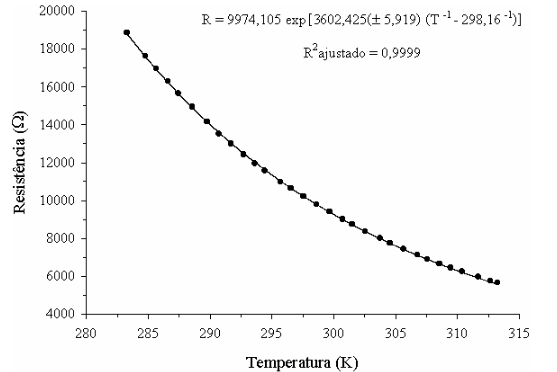

# Resistor Temperature Controller

This project aims to build an automatic controller for the temperature of a resistor using Arduino.

## Authors

- Carlos Alberto Magalhães; [Github](https://github.com/ccasmmjr)
- Eduardo Fiscina; [Github](https://github.com/duducaa)
- Natalia Martins Dias Santos; [Github](https://github.com/Natalia)
- Orlando Mota Pires; [Github](https://github.com/orlandomotapires)

## Theoretical Approach

Throughout the constant evolution of technology, the need for controlling industrial processes has always been prevalent. The development of increasingly specialized control methods has progressed alongside their growing necessity across various industrial sectors.

Among these control methods, temperature regulation stands out as one of the most crucial and well-established. It is responsible for maintaining optimal operational conditions for equipment such as electronic devices, which require precise temperature control to ensure efficiency and longevity. For instance, a deviation of 30 degrees Kelvin from the optimal operating range can significantly impact the efficiency of electronic components. Figure 1 illustrates the relationship between temperature (T) and electrical resistance (R), showing that a 30-degree Kelvin increase causes a 70% decrease in resistive capacity [1].

**Figure 1:** Effect of temperature variation (T) on electrical resistance (R).

  

## Project Description

This project involves creating a circuit with a resistive element powered by an electric voltage and cooled by a small fan. The primary objective is to develop mathematical models that accurately represent its behavior over time and optimize its operational efficiency. The ultimate goal is to implement a control system capable of maintaining the resistor's temperature within an ideal operating range.

### Project Stages

1. Prototype assembly.
2. Analysis of transient behavior of dynamic systems.
3. White-box modeling.
4. Control design via Root Locus method.
5. Control design via empirical methods.
6. Implementation of digital controllers.
7. Signal acquisition via microcontrollers.

## Objective

The main objective is to derive mathematical models for each control system. These models will be developed using various approaches, including Root Locus and other methods.

## General Solution

The project includes three code files located in the `src` folder:

### 1. `model_0.ino`

This code evaluates the fan's response to different PWM values, monitoring its RPM to assess how quickly it adjusts to changes in PWM signals.
- **First Approach:** Control the fan and analyze its response.

### 2. `model_1.ino`

This code implements the first control strategy:
- **Strategy 1:** Maintains the fan off and varies the power delivered to the resistor.

### 3. `model_2.ino`

This code implements the second control strategy:
- **Strategy 2:** Keeps the power delivered to the resistor constant while adjusting the fan speed.

## References

1. Neto, Antonio & Zolnier, Sérgio. (2006). "Evaluation of an electronic circuit for temperature measurement in agricultural installations using a computer's parallel port." Engenharia Agrícola. 26. [DOI: 10.1590/S0100-69162006000200001](https://doi.org/10.1590/S0100-69162006000200001).